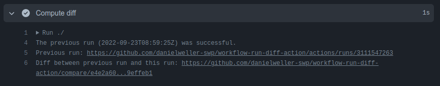

# workflow-run-diff-action

A GitHub action that outputs the diff between a workflow run and a previous run.

The intended use of this action is the following scenario.

You have a GitHub repository where a push to certain branches triggers a deployment - via a GitHub Actions worfklow - to some environments (e.g. push to the `release` branch triggers deployment to the `prod` environment).

You want to include a `git diff` with each deployment that shows the code difference between
this and the last (succesfull) deployment.

Example output:



## Usage

```
jobs:
  job_id:
    steps:
      - uses: 'danielweller-swp/workflow-run-diff-action@v1'
        name: Compute diff
        with:
          GITHUB_TOKEN: ${{ secrets.GITHUB_TOKEN }}
```